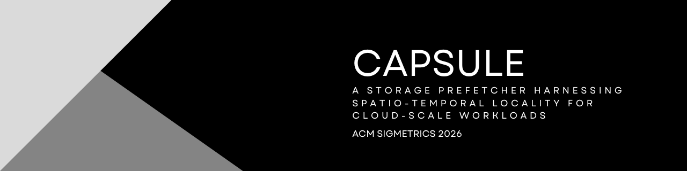
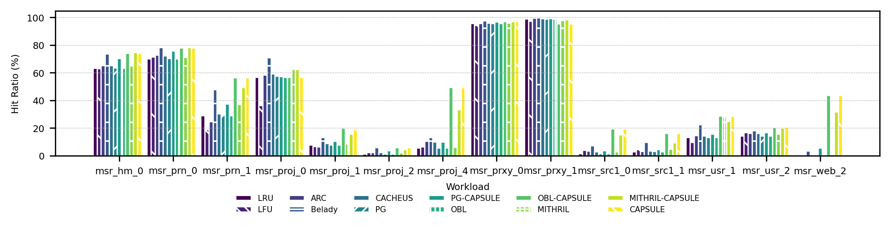
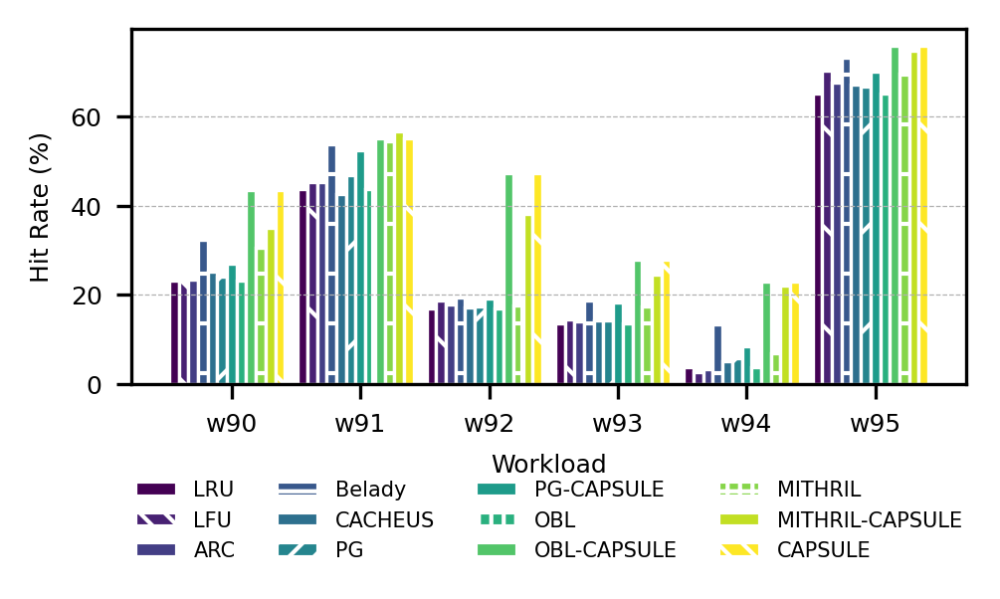

# CAPSULE: A Storage Prefetcher Harnessing Spatio-Temporal Locality for Cloud-Scale Workloads

This artifact contains the implementation of *CAPSULE: A Storage Prefetcher Harnessing Spatio-Temporal
Locality for Cloud-Scale Workloads*. It also includes baseline cache policies (LRU, LFU, ARC, Belady, CACHEUS) and
prefetching schemes (PG, OBL, and Mithril), all integrated into the
`libCacheSim` simulator.

This artifact corresponds to the version used in the ACM SIGMETRICS 2026 camera-ready submission (January 2026).

---

## Table of Contents

- [Code Provenance and Our Contributions](#code-provenance-and-our-contributions)
- [Requirements](#requirements)
- [Building the Simulator](#building-the-simulator)
- [Running Experiments](#running-experiments)
  - [CAPSULE](#run-capsule)
  - [Mithril](#run-mithril)
  - [LRU](#run-lru-no-prefetcher)
- [Reproducing Paper Figures](#reproducing-paper-figures)
  - [Figure 8 (MSR Workloads)](#figure-8-msr-workloads)
  - [Figure 9a (CloudPhysics Workloads)](#figure-9a-cloudphysics-workloads)
- [Artifact Contents](#artifact-contents)
- [Acknowledgments](#acknowledgments)
- [License](#license)

---

## Code Provenance and Our Contributions

This artifact is built on top of the open-source cache simulation framework
**libCacheSim**, which provides the core infrastructure for cache simulation,
baseline eviction policies, and several existing prefetching schemes.

### Original Code (libCacheSim)

The following components are inherited from the original libCacheSim framework
or prior work and are used without semantic modification:

- Cache simulator core infrastructure
- Baseline eviction policies:
  - LRU
  - LFU
  - ARC
  - Belady
  - CACHEUS
- Existing prefetching schemes:
  - PG
  - OBL
  - Mithril
- Trace parsing, workload drivers, and simulation harness

These components are included to enable fair and reproducible comparison with
prior state-of-the-art systems.

### Our Contributions (CAPSULE)

We extend libCacheSim with the following new functionality and experimental
support, which constitute the contributions of this artifact:

- **CAPSULE Prefetcher**  
  A new clustering-based prefetching algorithm that exploits spatio-temporal
  locality under long stack distance (LSD) workloads.

- **Adaptive Clustering and I/O Load Control**  
  Support for adaptive epsilon selection and
  configurable metadata budgets to balance prefetch aggressiveness and system
  load.

- **Integration with ioblazer for I/O-Aware Evaluation**  
  A new integration with *ioblazer* that enables I/O-aware simulation, allowing CAPSULE to be evaluated under realistic I/O contention and storage behavior.

- **Advanced Runtime Parameters**  
  New command-line options to control CAPSULE behavior, including:
  - adaptive vs. fixed epsilon
  - neighbor-based prefetching
  - maximum prefetch degree
  - metadata budget constraints

All CAPSULE- and ioblazer-related extensions are implemented within this
artifact and were not part of the original libCacheSim codebase.

---

## Requirements

- OS: Linux (tested on Ubuntu 18.04)
- Compiler: `gcc` or `clang`
- Build system:
  - `cmake` (version 3.12 or higher)
- Tools:
  - `make`
  - `zstd` (for compressed trace support)
- Libraries:
  - `libaio` (for I/O operations)
- Optional: Detailed installation instructions are available in [`doc/install.md`](doc/install.md)

---


## Building the Simulator

```bash
mkdir _build
cd _build
cmake ..
make -j$(nproc)
cd ..
```

This compiles the `cachesim` binary under `_build/bin/`.

---

## Running Experiments

You can run the simulator with different workloads, cache sizes, and prefetching algorithms.  
Below we provide an example using the **OracleGeneral** workload from the CloudPhysics dataset.

### Download Dataset

Workload traces can be obtained from the public cache dataset repository:

- https://github.com/cacheMon/cache_dataset

For example, download the `w25.oracleGeneral.bin.zst` trace:

```bash
wget -P data https://cache-datasets.s3.amazonaws.com/cache_dataset_oracleGeneral/2015_cloudphysics/w25.oracleGeneral.bin.zst
```

### Run CAPSULE 

```bash
./_build/bin/cachesim ./data/w25.oracleGeneral.bin.zst oracleGeneral lru 256MB --prefetch=CAPSULE
```

### Advanced
```bash
./_build/bin/cachesim ./data/w25.oracleGeneral.bin.zst oracleGeneral <eviction> 256MB \
  --prefetch=CAPSULE \
  --fixed=0 \
  --adaptive=true \
  --neighbor=false \
  --io=false \
  --max-prefetch=100 \
  --max-metadata=0.1
```

#### Parameters:
- `<eviction>`: Set eviction policy (lru, lfu, arc, belady, cacheus, etc.)
- `--prefetch`: Set prefetching policy (OBL, PG, Mithril, or CAPSULE)
- `--fixed`: Set 0 for adaptive epsilon, set with > 0 for fixed epsilon
- `--adaptive`: Set true for adaptive epsilon, set false for fixed epsilon
- `--neighbor`: Set true or false to enable or disable neighbor prefetching
- `--io`: Run with real I/O simulation
- `--max-prefetch`: Set max number of prefetched blocks per trigger.
- `--max-metadata`: Fraction (0–1) of cache dedicated to CAPSULE metadata. default 0.1 (10%)

---

### Run Mithril

```bash
./_build/bin/cachesim ./data/w25.oracleGeneral.bin.zst oracleGeneral lru 256MB --prefetch=Mithril
```

---

### Run LRU (No prefetcher)

```bash
./_build/bin/cachesim ./data/w25.oracleGeneral.bin.zst oracleGeneral lru 256MB
```

---

## Environment Setup

This artifact requires Python 3.11. All experiments and figures were
generated using the environment described below.

```bash
pip install -r requirements.txt
```

---

## Reproducing Paper Figures

The following figures are generated by the scripts provided in this
artifact. The commands listed under each figure download the required
datasets, run the simulator, and generate the corresponding plot from
scratch.

---

### Figure 8 (MSR Workloads)



```bash
bash test/download-msr.sh
python test/run-msr.py
python test/plot-msr.py
```

### Figure 9a (CloudPhysics Workloads)



```bash
bash test/download-cp.sh
python test/run-cp.py
python test/plot-cp.py
```


---


## Artifact Contents

```
├── doc/                    # Documentation
├── ioblazer/               # I/O workload utilities
├── libCacheSim/            # Cache simulator core and CAPSULE code
├── test/                   # Test cases and validation scripts
└── README.md               # Artifact documentation
```

---

## Acknowledgments

This simulator is based on the excellent work by [libCacheSim](https://github.com/1a1a11a/libCacheSim), a lightweight caching simulation framework.

If you use this artifact, please also consider citing their project.
We extend this framework with our proposed prefetching method (CAPSULE) for experimental evaluation.

---

## License

This artifact is released under the GNU General Public License v3.0 (GPLv3).

This work extends the libCacheSim framework, which is also licensed
under GPLv3. All original license notices are preserved.
